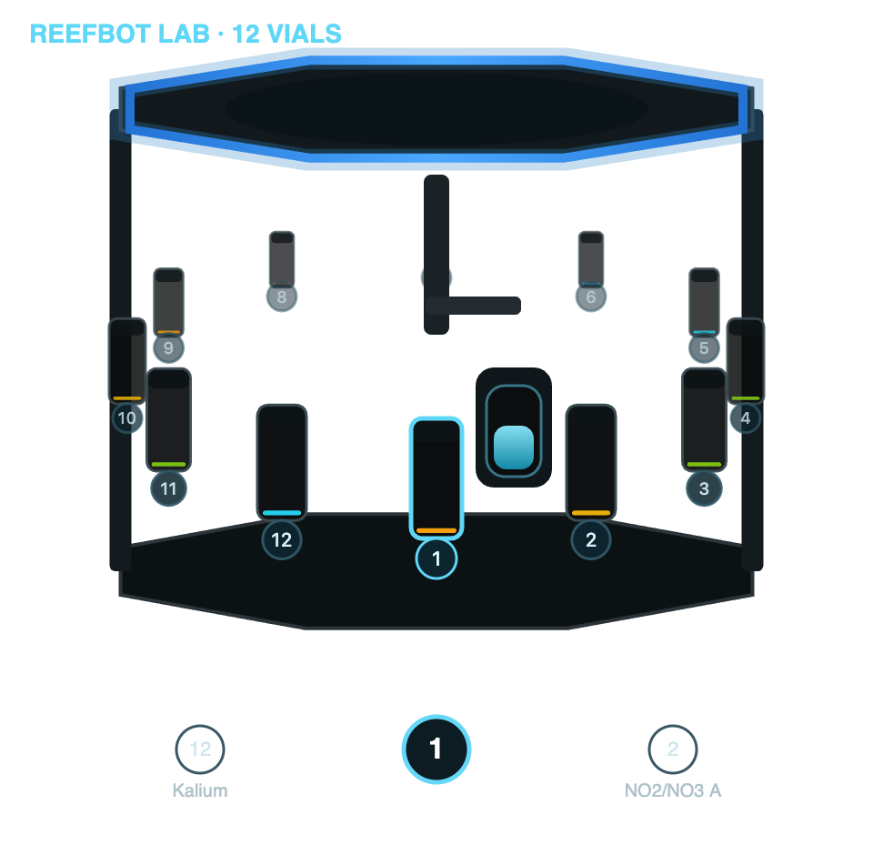

# Reef Kinetics ReefBot for Home Assistant

Bring your **Reef Kinetics ReefBot** automatic aquarium tester into Home Assistant — with live test results, tube and maintenance status, one-tap test starts, and a dedicated ReefBot-styled control panel in the sidebar.

  

> The panel does not talk to the Reef Kinetics cloud directly. It only reads the Home Assistant entities this integration creates and presses the existing Home Assistant button entities — so everything you see and do stays inside Home Assistant's permission model.

## Why use it

- **Everything in one place.** Your latest reef parameters (Alk, Ca, Mg, NO₃, PO₄, …) live next to the rest of your smart‑home data — ready for dashboards, history graphs, and automations.
- **Automate around your tests.** Trigger notifications, dosing logic, or scenes from real measured values and from the tester's own state (running / pending / idle).
- **Start tests without opening the app.** Each configured test gets its own Home Assistant button entity.
- **See the machine, not a table.** The sidebar panel reproduces the ReefBot's look — the vial carousel, chamber, syringe, and RODI/Waste levels — instead of a wall of raw sensors.
- **Both models supported.** Auto‑detects the **ReefBot V2 (8 vials)** and the **ReefBot Lab (12 vials)** and draws the matching machine graphic.
- **Safe by design.** Read‑only by default; every write action is an explicit Home Assistant button/number you press yourself. Credentials are used once for a token and never stored in plain text.

## Supported hardware

| Model | Vials | Panel graphic |
|---|---|---|
| ReefBot V2 | 8 | 8‑slot machine with animated syringe gantry |
| ReefBot Lab | 12 | 12‑vial 2.5D carousel |

Detection is automatic from the device's reported vial count.

## Features

### Data & status
- UI‑based setup and login through the Home Assistant UI.
- Cloud polling via `https://gateway.reefkinetics.com` (default every 5 minutes).
- Online status binary sensor; firmware, serial number, vial count, tank name, and tank volume sensors.
- Dynamic sensors for **all** parameters returned by the ReefBot API, each with a compact per‑parameter result history in its attributes.
- Tube volume sensors named with their configured chemicals, including fill‑percentage attributes.
- Current‑operation and pending‑operation sensors for manually started or queued tests.
- Read‑only maintenance sensors for **Syringe, Waste, and RODI** (current value, capacity, percentage, display value).
- Read‑only sensors for notifications, configured safe margins, alarm logs, and pending calibrations.
- Diagnostics with sensitive fields redacted.

### Control (explicit, one‑tap)
- **Start‑test buttons** for every configured test.
- **Tube refill buttons** — set one tube back to its configured full volume.
- **Maintenance buttons** for Syringe / Waste / RODI that mirror the dashboard's replace / empty / refill actions.
- **Capacity number entities** for dashboard‑enabled components (e.g. Waste, RODI).

### Sidebar panel
- ReefBot‑styled visual control surface for tests, vial levels, RODI/Waste, syringe usage, and current operation state.
- Live mini‑history charts per parameter.
- **Test‑configuration editor** with smart *kit clustering*: reagents that belong to the same test kit are grouped automatically (matching the app's behaviour), with localized parameter names.
- **Reagent‑maintenance mode**: carousel of tubes with refill actions.

## Screenshots

  

*ReefBot Lab (12 vials) carousel as rendered by the sidebar panel. More views (V2 machine, tests, RODI/Waste, configuration editor) coming soon.*

## Installation with HACS

1. Add this repository as a custom HACS repository of type **Integration**.
2. Install **Reef Kinetics ReefBot**.
3. Restart Home Assistant.
4. Add the integration from **Settings → Devices & services**.

## Setup

The setup flow asks for your Reef Kinetics dashboard login:

- Email
- Password

The password is used once to request a cloud token and is **not** stored in the Home Assistant config entry. The integration stores the returned token, token expiry, user ID, and a generated web device token. If the token expires, Home Assistant starts a reauthentication flow and asks for the password again.

The integration then discovers devices and tanks. If more than one tank is returned, Home Assistant asks which tank to use.

> Do not share these credentials, and do not commit HAR files or real API payloads to a public repository.

## What it can and cannot do

This integration can start configured one‑time tests, refill configured chemical tube values, reset basic maintenance component values (Syringe / Waste / RODI), and update dashboard‑enabled component capacities — all through explicit Home Assistant button and number entities. **Test buttons can consume reagents.** Refill and maintenance buttons update the Reef Kinetics cloud state for the selected item.

It does **not** abort tests, calibrate the device, or perform maintenance write operations beyond the exposed reset buttons and capacity numbers. The dashboard's component `Unlimited` checkbox is not exposed yet.

## Polling

The default polling interval is 5 minutes. ReefBot tests are much less frequent than this; the interval is intentionally conservative for early testing and can be made configurable later.

## Known API endpoints

The Reef Kinetics cloud API used here is **undocumented** and observed from the official web dashboard. It may change without notice.

- `POST /api/APIService/GetUserDevices`
- `POST /api/APIService/GetUserTanks`
- `POST /api/APIService/GetOperationResultsByTankIdWithColorsV2`
- `POST /api/APIService/GetPendingOperationRequestsByTank`
- `POST /api/APIService/GetOperationRequestsHistoryByTankId`
- `POST /api/APIService/OneTimeOperationRequest`
- `POST /api/APIService/UpdateDeviceAvailableChemicalsSettingsV2`
- `POST /api/APIService/UpdateDeviceAvailableChemicalsPositions`
- `POST /api/APIService/GetDeviceComponentSettings`
- `POST /api/APIService/UpdateDeviceComponentSettings`
- `POST /api/APIService/CheckPendingCalibrationRequestsV2`
- `POST /api/APIService/GetSizeTypes`
- `POST /api/APIService/GetComponents`
- `POST /api/APIService/GetTankAlarmsByTankId`
- `POST /api/APIService/GetAlarmLogsByTankId`
- `POST /api/Notifications/GetUserNotifications`
- `POST /api/APIService/GetNotReadUserNotificationsCount`

## Roadmap

- More carefully reviewed maintenance / calibration workflows.
- Options flow for the polling interval.
- Richer parameter metadata as more API samples become available.
- Optional support for multiple tanks per account.
- Additional panel screenshots (V2 machine, tests, configuration editor).

## Status & disclaimer

Early development. This integration is **not affiliated with, endorsed by, or supported by Reef Kinetics**. Use at your own risk.
